# Netflix Clone Deployment with Jenkins - DevSecOps Project

This project demonstrates the deployment of a Netflix clone application using Jenkins on AWS EC2, incorporating DevSecOps practices.

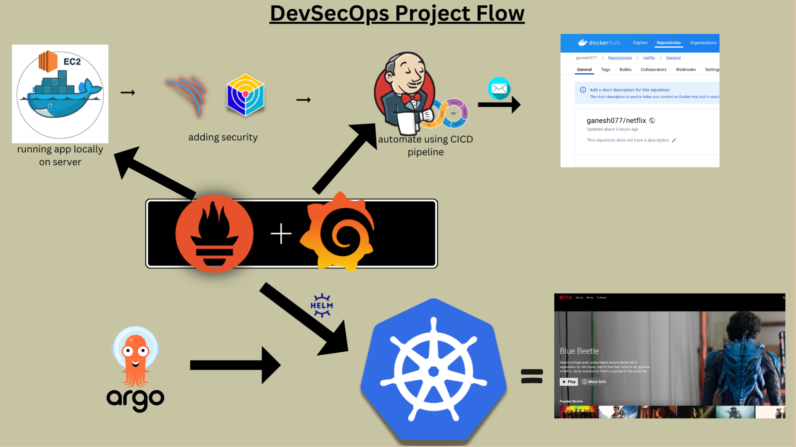
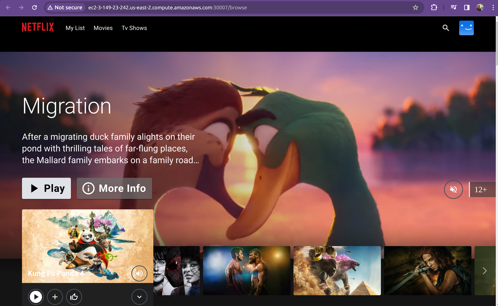
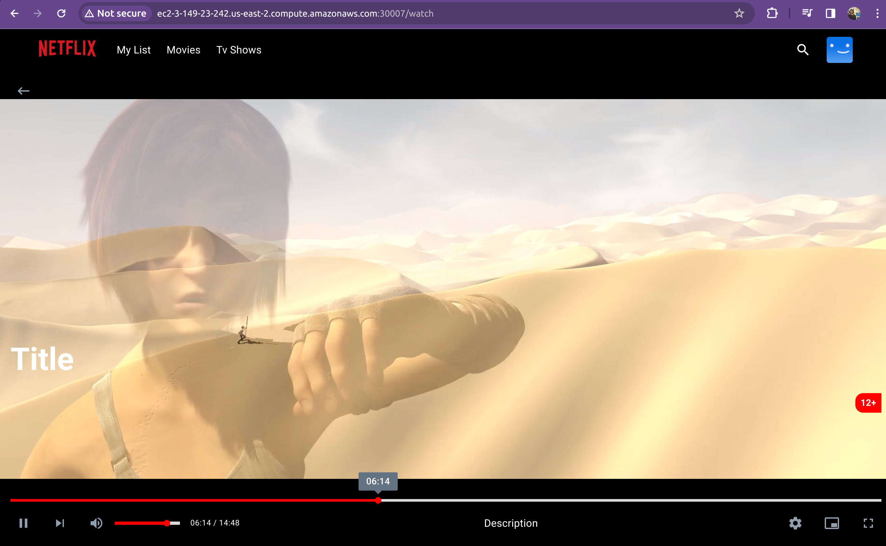

## Features

- **Phase 1: Initial Setup and Deployment**
  - Launch EC2 instance and clone the code repository
  - Install Docker and run the app using a container
  - Obtain TMDB API key for accessing movie data
 
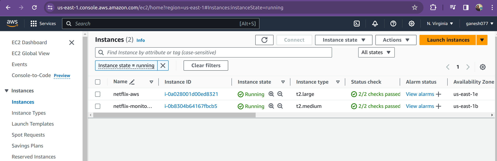

- **Phase 2: Security**
  - Install SonarQube and Trivy for vulnerability scanning
  - Integrate SonarQube with CI/CD pipeline
  - Configure SonarQube to analyze code for quality and security
 
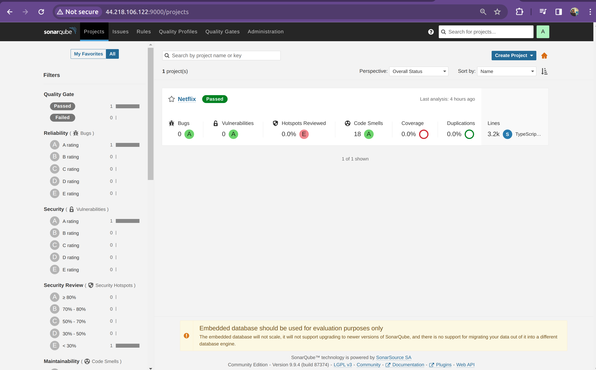

- **Phase 3: CI/CD Setup**
  - Install Jenkins for automation and necessary plugins
  - Configure Java, Node.js, and SonarQube in Jenkins
  - Create CI/CD pipeline for automated deployment
 
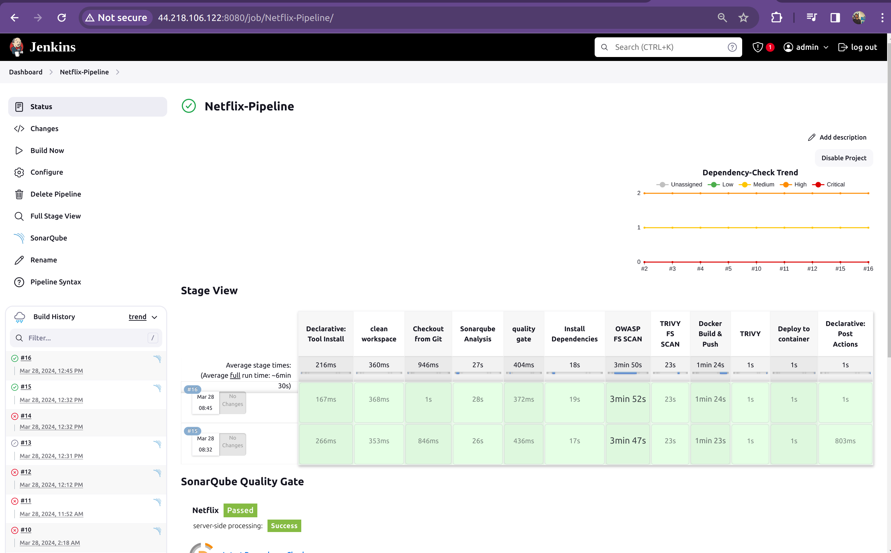
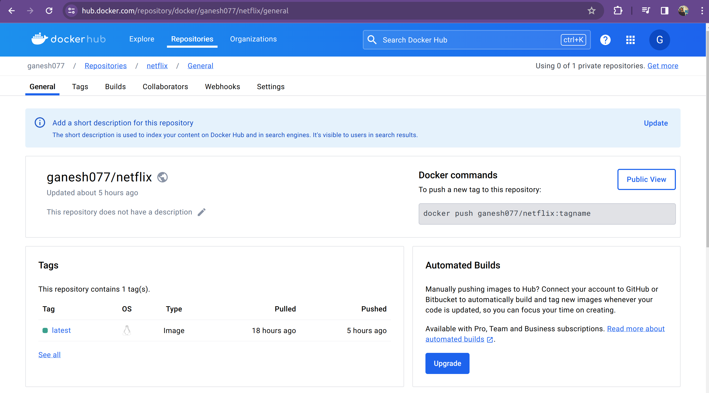

- **Phase 4: Monitoring**
  - Install Prometheus and Grafana for monitoring
  - Configure Prometheus to scrape metrics from Node Exporter and Jenkins
  - Set up Grafana to visualize metrics
 
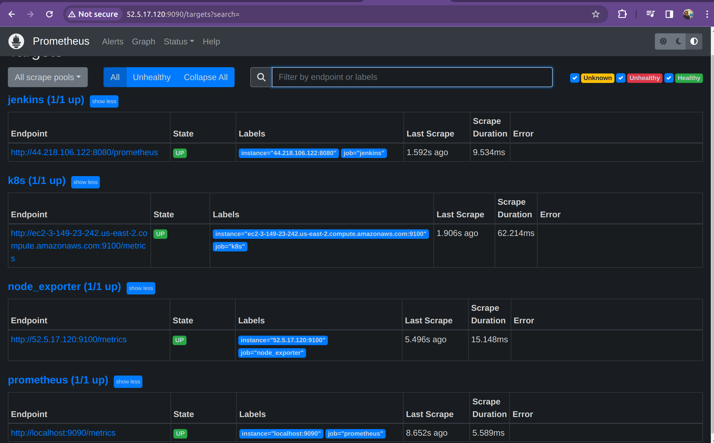
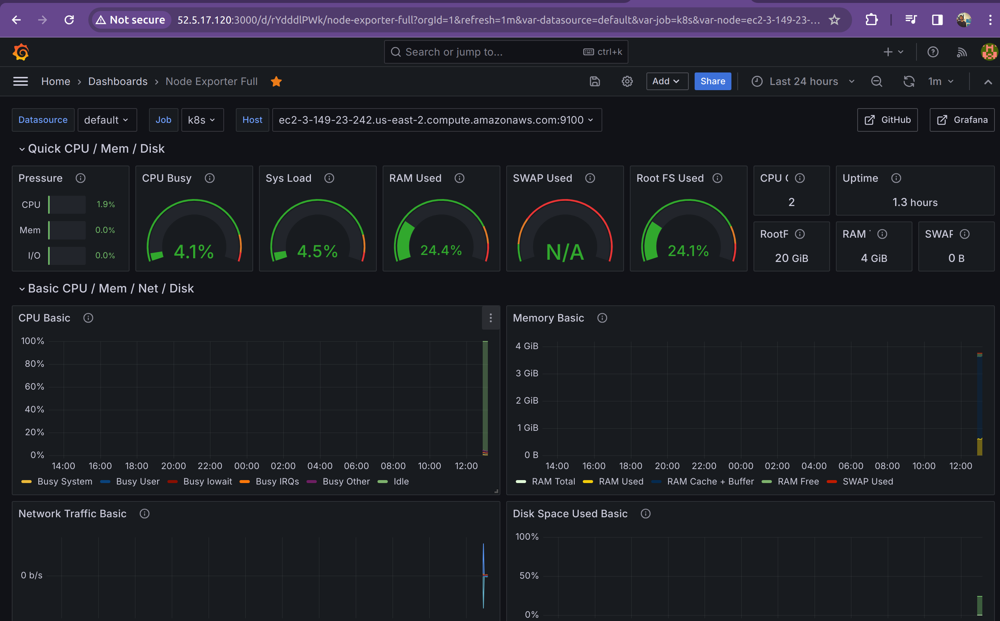

- **Phase 5: Notification**
  - Implement email notifications in Jenkins or other notification mechanisms
 
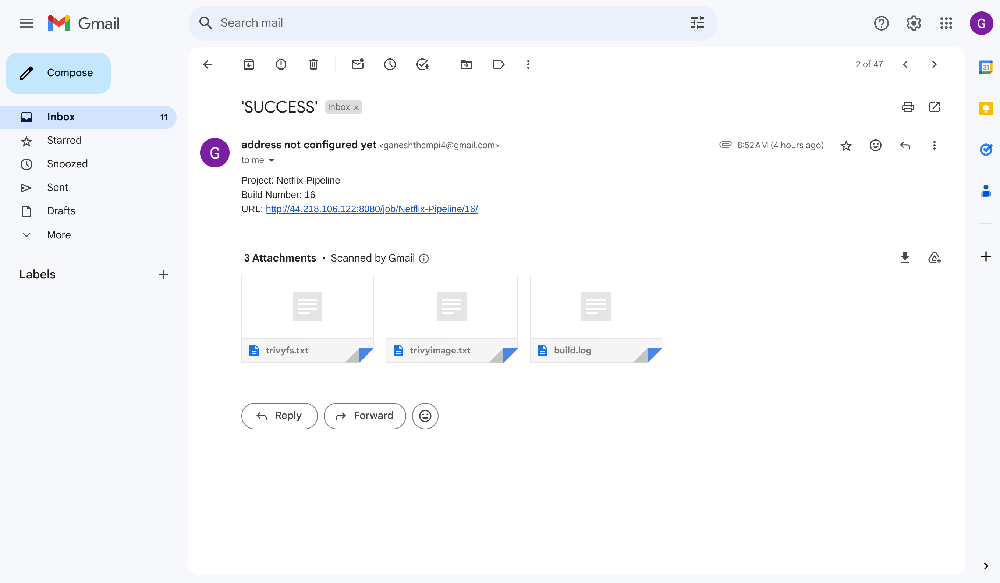

- **Phase 6: Kubernetes**
  - Create Kubernetes cluster with node groups
  - Monitor Kubernetes with Prometheus
  - Install Node Exporter using Helm
  - Add a job to scrape metrics in Prometheus configuration
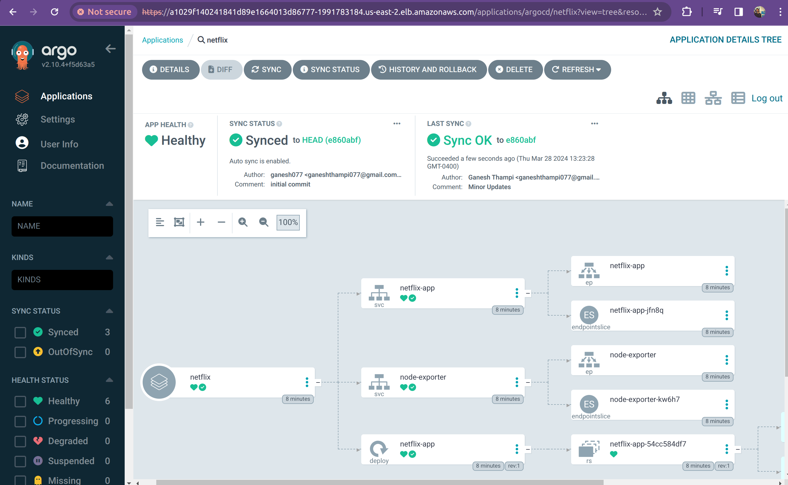
